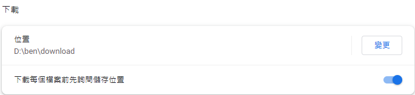

# Grab at Once!

Chrome extension that allow downloading files in one go.

## Usage

- 建議在[設定]("chrome://settings/downloads")頁面中，關閉"下載每個檔案前先詢問儲存位置"功能。
  

## 打算新增的功能

- [x] 點選 icon 能開關功能
- [ ] 選項能新增下載檔案副檔名類型
- [ ] 考慮框選時同時須按住鍵盤某個鍵
- [ ] 選擇到的 element 能改變顏色
- [ ] 框選時關閉原本滑鼠在網頁上的效果
- [ ] 選項能新增下載檔案副檔名類型

## Bugs

- [ ] 框選區塊停留沒有跟著捲動下來

## Attribution

designed by [Pixel perfect]("https://www.flaticon.com/free-icon/grab_1196462") from [Flaticon]("https://www.flaticon.com")
